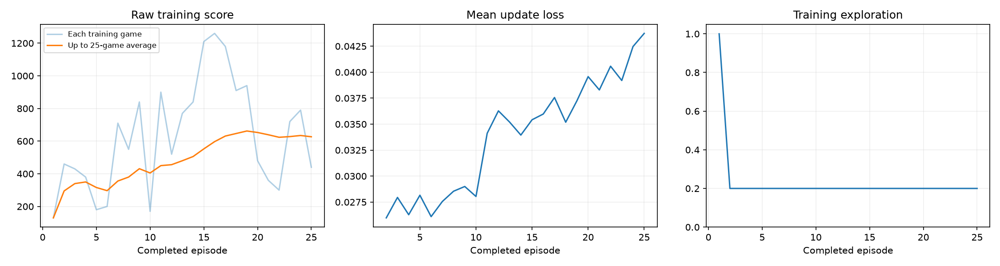
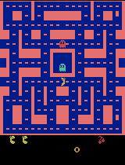
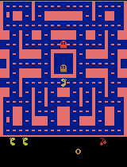

# Ms. Pac-Man DQN

A Deep Q-Network (DQN) agent trained to play Ms. Pac-Man (`ALE/MsPacman-v5`) as a class exercise in reinforcement learning. This repo contains the executed training notebook, the code, and the evaluation evidence from one training run.

## Running it yourself

Open [pacman_dqn.ipynb](pacman_dqn.ipynb) in Jupyter, VS Code, or Google Colab with a Python 3.11-3.13 kernel. The notebook installs its own dependencies (see [requirements.txt](requirements.txt) for pinned versions) and auto-detects GPU/CPU. Edit the three hyperparameters in section 1, then Run All. The linked notebook above is the executed version, with all outputs from the run described below already visible — no need to rerun it to see the results.

## My three hyperparameters

| Setting | Value | Why |
|---|---|---|
| Exploration | **0.20** | The agent holds this epsilon constant for the entire run after a 1,000-decision random warm-up (no decay), so a lower constant value lets the learned policy actually influence the training data instead of being drowned out by persistent randomness. |
| Episodes | **25** | A step up from the notebook's suggested 5-episode sanity check, large enough to see whether any learning signal emerges, while still being a quick first run rather than a full-scale benchmark. |
| Learning rate | **0.0001** | The notebook's default and a standard, stable value for Adam-optimized DQN; the training loop raises an error on non-finite loss, which is the typical failure mode of a learning rate set too high. |

## What I expected vs. what happened

**Expected:** With only 25 episodes (about 16k decisions), I expected little or no measurable improvement — enough data to sanity-check the pipeline, not enough to learn robust Pac-Man play.

**Observed:** The trained agent's mean evaluation score more than doubled versus the untrained baseline.

| Seed | Before (untrained) | After (25 episodes) |
|---|---|---|
| 101 | 350 | 630 |
| 202 | 500 | 890 |
| 303 | 320 | 880 |
| 404 | 800 | 560 |
| 505 | 490 | 2140 |
| **Mean** | **492.0** | **1020.0** |

Change in mean score: **+528.0 (+107%)**. None of the 10 evaluation games hit the fixed time limit (all ended in a natural game over). Full breakdown: [results/comparison.json](results/comparison.json).

## Gameplay

- Before training: [results/demos/before_training.gif](results/demos/before_training.gif)

  

- After 25 episodes (checkpoint sample): [results/demos/episode_0025_intermediate.gif](results/demos/episode_0025_intermediate.gif)

  

- Best of the five final evaluation games: [results/demos/final_best_trained.gif](results/demos/final_best_trained.gif)

  

All GIFs show at most the first 20 seconds of game time at 4x playback speed; reported scores cover the entire evaluated game.

## Training budget actually used

- Completed episodes: **25 / 25**
- Total decisions: **16,346**
- Learning updates: **3,837**
- Elapsed time: **~136 seconds** (~2.3 minutes)
- Hardware: CPU only (no GPU used), Python 3.12.3, PyTorch 2.14.0+cpu, on Windows via WSL2 Ubuntu

Full config, including package versions and every fixed setting: [results/config.json](results/config.json). Per-episode log: [results/training.csv](results/training.csv). Run summary: [results/training_summary.json](results/training_summary.json). This run completed normally (not interrupted) and had learning updates from partway through episode 1 onward.

## What the agent sees, does, and is rewarded for

- **Observations:** four stacked 84x84 grayscale game screens, so the network can infer movement (a single frame only shows position).
- **Actions:** one of the joystick moves available in Ms. Pac-Man (up/down/left/right and combinations, depending on the game's action set).
- **Rewards:** the game's own points (pellets, fruit, ghosts eaten), clipped to [-1, 1] during training so no single event dominates a learning update; the scores reported above are the original, unclipped game scores.

## Limitation

Five evaluation games is a very small sample, and the mean is heavily influenced by a single standout game (seed 505 scored 2140, more than double any other game before or after training). A different set of five seeds could easily show a smaller — or no — improvement. This is a first-check result, not evidence of robust learned play.

## Next experiment

I would change **episodes only** (keeping exploration at 0.20 and learning rate at 0.0001 fixed) and scale up to around 200-300 episodes. Since epsilon does not decay in this setup, exploration and learning rate stay comparable across runs — episodes is the lever most likely to reveal whether the early improvement seen here holds up or was partly luck from a small sample.

## Notes

- Model checkpoints (`trained.pt`, `untrained.pt`, per-episode `.pt` files) are not included in this repo to keep it small; they are kept locally alongside the full run ZIP.
- `pacman_player.py` is only used for the local floating gameplay popup during interactive runs and has no effect on training or evaluation results.
